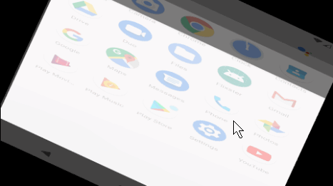
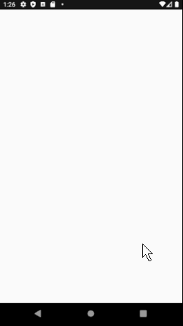

# Flix
Flix is an app that allows users to browse movies from the [The Movie Database API](http://docs.themoviedb.apiary.io/#).

📝 `NOTE - PASTE PART 2 SNIPPET HERE:` Paste the README template for part 2 of this assignment here at the top. This will show a history of your development process, which users stories you completed and how your app looked and functioned at each step.

---

## Flix Part 1
Submitted by: **Michael Lofton**

Time spent: **9** hours spent in total

### User Stories
#### REQUIRED (10pts)
- [X] (10pts) User can view a list of movies (title, poster image, and overview) currently playing in theaters from the Movie Database API.

#### BONUS
- [X] (2pts) Views should be responsive for both landscape/portrait mode.
   - [X] (1pt) In portrait mode, the poster image, title, and movie overview is shown.
   - [X] (1pt) In landscape mode, the rotated alternate layout should use the backdrop image instead and show the title and movie overview to the right of it.

- [X] (2pts) Display a nice default [placeholder graphic](https://guides.codepath.org/android/Displaying-Images-with-the-Glide-Library#advanced-usage) for each image during loading
- [X] (2pts) Improved the user interface by experimenting with styling and coloring.
- [ ] (2pts) For popular movies (i.e. a movie voted for more than 5 stars), the full backdrop image is displayed. Otherwise, a poster image, the movie title, and overview is listed. Use Heterogenous RecyclerViews and use different ViewHolder layout files for popular movies and less popular ones.

### App Walkthough GIF
 

 

### Notes
Challenges:
 - It was tricky getting the placeholder to align properly to the image sizes. I used 2 different drawables (one for each orientation) and resized them using [this online tool](https://onlinepngtools.com/resize-png) so they would fit better. I tried to use glide's fitCenter and centerCrop method to have it scale (and crop if necessary) to fit the dimensions of the movie posters but all combinatinos of using those methods cut or distort the retrieved poster image. In the future, I think I could look into those functions further, or other image processing methods from the Glide library.
 
Placeholder:
- The placecholders images I used were from this website: https://www.iconfinder.com/. This work is licensed under a [Creative Commons Attribution 3.0 Unsupported License](http://creativecommons.org/licenses/by/3.0/)

UI Improvements:
- Bolded the title of each movie for better element distinction
- Added padding for each movie (row) for better separation
- Created primary and secondary colors for more interesting contrast and improved user experience

### Open-source libraries used
- [Android Async HTTP](https://github.com/codepath/CPAsyncHttpClient) - Simple asynchronous HTTP requests with JSON parsing
- [Glide](https://github.com/bumptech/glide) - Image loading and caching library for Androids
